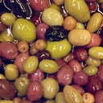
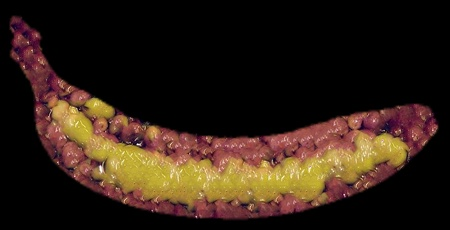

# bmquilting

`bmquilting` is a Python library for texture synthesis based on image quilting algorithms. It synthesises new textures from small source samples by intelligently stitching patches together.

## Features

- **Dual Grid and Patch Shape Support:** Square patches on a cartesian grid, or circular patches over a hexagonal lattice.
- **Multiple Stitching Modes:** Seams, blurred seams, feathering, or hybrid stitching solutions.
- **Adaptive Seam Blending:** Dynamically adjusts blur intensity based on local gradient differences to conceal transitions.
- **Proxy Synthesis:** Match patches using simplified proxies (blurred, downscaled, etc.) whilst reconstructing with full-resolution detail.
- **Seamless Tiling:** Built-in functions to make any texture tileable.
- **Hole Filling:** Inpaint textures with missing or masked-out regions.
- **Texture Transfer:** Transfer the texture of one object onto another, or create a textured stencil of a subject.
- **Incomplete References:** Mark invalid sections of a source image; the library will still make partial use of them during synthesis.
- **Parallel Generation:** Multi-process variants of synthesis functions for faster throughput.
- **Block Size Heuristics** *(Experimental)*: Automatically estimate a suitable patch size using FFT or SIFT descriptor distributions.

## Synthesis Examples

|  |  |  |
| :---: | :---: | :---: |
|  |  |  |
|  |  |  |
|  |  |  |

## Requirements

- Python 3.12 or higher
- See `pyproject.toml` for full dependency list

## Installation

Install directly from source:

```bash
# Basic installation
pip install .

# With Numba acceleration (improves certain internals; overall speedup is typically 1–6%)
pip install .[fast]
```

## Documentation

| Resource | Description |
| :--- | :--- |
| [Main Documentation Index](docs/main.md) | Full API reference and overview |
| [Quick Start Guide](docs/quick_start.md) | Examples including circular patching and inpainting |
| [Arguments Explained](docs/args_explained.md) | Deep dive into block size, overlap, and tolerance |
| [Advanced Configuration](docs/advanced_config.md) | Fine-tuning blending kernels and seam algorithms |
| [Demo Scripts](extras/demos) | Runnable examples for synthesis and utility functions |

---


## Licence

This project is distributed under [MIT](LICENSE) licence.


