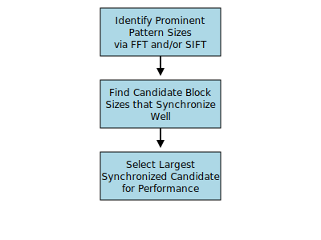
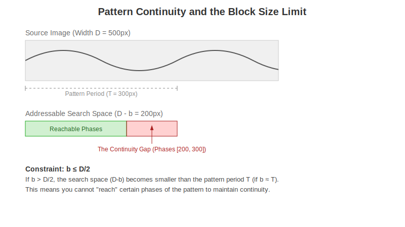

# Block Size Selection Heuristic


The `guess_nice_block_size` function (located in `bmquilting/utils/guess_blocksize.py`) implements a multi-layered heuristic to automatically estimate an adequate block size that captures the primary structural periodicities of a source texture.

The diagram below summarizes the heuristic in a nutshell.




## How to Use

`guess_nice_block_size`  can be called directly from the package root:

```python
import bmquilting

# Single-channel or multi-channel image (NumPy array)
image = ...

# Default behavior: FFT-only analysis
block_size = bmquilting.guess_nice_block_size(image)

# Choose heuristic based on your preference:
# - "fft": Frequency spectrum analysis only
# - "sift": SIFT keypoint distribution analysis only
# - "both": Combined FFT and SIFT analysis
block_size_fft = bmquilting.guess_nice_block_size(image, heuristic="fft")
block_size_sift = bmquilting.guess_nice_block_size(image, heuristic="sift")
block_size_both = bmquilting.guess_nice_block_size(image, heuristic="both")

print(f"{block_size=}\n{block_size_fft=}\n{block_size_sift}\n{block_size_both=}")
```

Or equivalently (backward-compatible boolean flag):

```python
from bmquilting import guess_nice_block_size

block_size = guess_nice_block_size(image, True)   # Equivalent to "fft" only
block_size = guess_nice_block_size(image, False)  # Equivalent to "both" 
```

## Detailed Heuristic Breakdown

### 1. Frequency-Based Analysis (FFT)

This analysis identifies dominant periodicities in the texture by analyzing its magnitude spectrum in the frequency domain.

1.  **FFT Computation**: The image is transformed using the Discrete Fourier Transform (DFT) to obtain its frequency spectrum.
2.  **Peak Identification**: The spectrum is searched for coordinates $(x, y)$ with the highest magnitude values (excluding the DC component).
3.  **Wavelength Calculation**: For each peak, the frequency is calculated as the maximum relative distance from the center.
    <!--$$f = \max\left(\frac{|y - H/2|}{H}, \frac{|x - W/2|}{W}\right)$$
    The corresponding wavelength (pattern distance) is then $d = 1/f$.-->
4.  **Weighting**: These wavelengths are weighted by their corresponding magnitudes in the spectrum.

### 2. Keypoint-Based Analysis (SIFT)

> ⚠️ **WARNING:**
> SIFT analysis is computationally expensive and can be significantly slower than FFT. It is recommended primarily for small source images where frequency analysis alone might be insufficient to capture complex structural features.

If the heuristic includes SIFT (e.g., `heuristic="sift"` or `heuristic="both"`), the algorithm also employs SIFT (Scale-Invariant Feature Transform) descriptors to identify structural patterns that might not be purely periodic.

#### Cluster Size Heuristic
1.  **Keypoint Detection**: SIFT keypoints are extracted from the source image.
2.  **Scale Clustering**: Keypoints are clustered based on their size (diameter) using K-Means, with the optimal number of clusters determined by the Silhouette score.
3.  **Area Weighting**: Each cluster center (representing a characteristic scale) is paired with a weight proportional to the total area covered by keypoints in that cluster.
    <!--$$\text{Weight} = (\text{Cluster Diameter})^2 \times 0.5 \times \text{Keypoint Count}$$-->

#### Cluster Distance Heuristic
1.  **Intra-Cluster Distances**: For each cluster, the algorithm calculates the minimum distance between any two keypoints belonging to that same cluster. 
2.  **Spatial Weighting**: This minimum distance is weighted by the median area of the bounding boxes between such equidistant keypoints, multiplied by the total number of keypoints in the cluster. 


The outputs of the Cluster Size and Cluster Distance heuristics are merged into a single set of distance-weight pairs. These combined pairs are normalized and later combined with FFT-based pairs (if selected) in the synchronization stage.

### 3. Synchronization and Final Guess

The results from both analyses are filtered, normalized, and combined into a list of "Size-Weight Pairs" $(d, w)$.

1.  **Candidate Search**: The algorithm iterates through potential block sizes $b$ within the range $[\min(d), \min(\text{dimension}) / 2]$. The upper bound ensures **pattern continuity**: by keeping $b \leq \text{min\_dim} / 2$, the algorithm guarantees that even for the largest repeating patterns, there is sufficient "addressable search space" in the source image to find a valid patch that satisfies overlap requirements.

    

    Without this "sliding space," the algorithm might reach a state where it cannot find a patch that both matches the existing overlap and continues the pattern correctly (creating a "Continuity Gap").
2.  **Sync Scoring**: For each candidate block size $b$, a cumulative "penalty score" is calculated. This score measures how well $b$ synchronizes with all identified patterns $(d, w)$, weighted by their relative importance $w$:
    *   If $b < d$: $\text{penalty} = (d - b) \times w$ (heavily penalizes block sizes smaller than the pattern).
    *   If $b \geq d$: $\text{penalty} = \min(b \pmod d, d - (b \pmod d)) \times w$ (measures how close $b$ is to being a multiple of $d$).
3.  **Selection**: The algorithm calculates the weighted sum of penalties across all patterns for each candidate. Those with the lowest cumulative penalties (highest synchronization with the most dominant patterns) are identified as the best candidates.
4.  **Final Selection**: The heuristic returns the largest candidate among the best-synchronized values, thus minimizing the total number of patches required for synthesis. This approach selects the most efficient option to optimize algorithm performance.