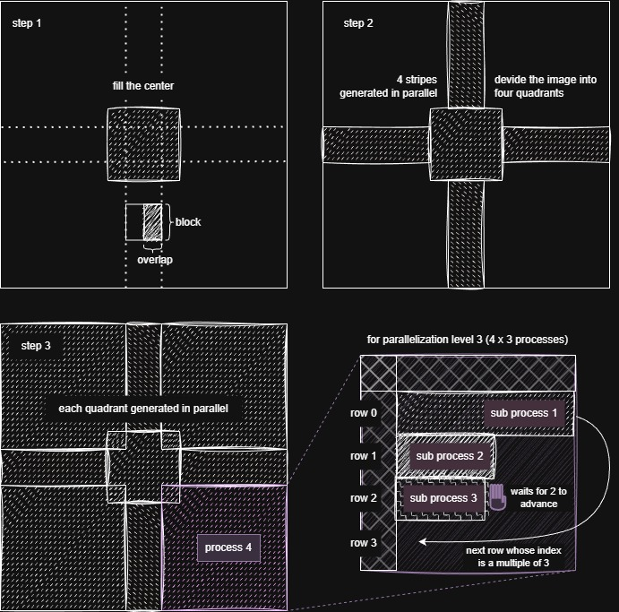
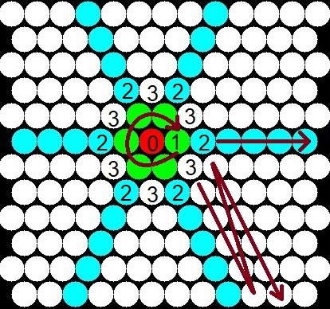

# Parallelization 

The main strategy employed for parallelization is the radially structure generation approach, starting from the center, that aims to divide the generation into independant regions.

This optimization was not implemented for all the methods that could benefit from it. The ones that use it, are the ones mentioned in this section.


### For texture generation using Square Patches

```
from bmquilting.generate.py import generate_texture_parallel 
```



The generation process, brokendown in the above image, is comprised of the following 4 steps:

1. The center of the texture is patched using the normal, non-parallel, algorithm. This is done so that there are no common areas to the processes running in the following steps.
2. Each stripe each generated independantly, in a separate process, starting from the center patched area.
3. Each quadrant is filled independantly, in a separate process.
4. If the `nps` (number of parallel stripes) is greater than 1, multiple stripes are computed in parallel. 
Because a stripe requires the previous one to be at least one block ahead, the coordination between processes causes some overhead; thus, it is recommended to only use `nps` higher than 1 for larger generations. 

Note that, for this method, the minimum `nps` of 1 always starts 4 processes. 
The current implementation does not allow for a more granular control.


### For Texture generation using Circular Patches

```
from bmquilting.???.py import TBD 
```



The generation process, brokendown in the above image, is comprised of the following 5 steps:

0. A random patch is selected for the center of the texture.
1. The area around the center is patched. This is done so that there are no common areas to the processes running in the following steps.
2. Each stripe each generated independantly, in a separate process, starting from the center patched area.
3. Each section is filled independantly, in a separate process.
4. (NOT IMPLEMENTED) Similarly to the square patches variant, the hexagonal "stripes" could be processed in parallel.

The `num_jobs` indicates how many parallel processes should run. The ceiling for `num_jobs` is, therefore, 6, corresponding to the maximum number of stripes and sections that can be computed simultaniously.
