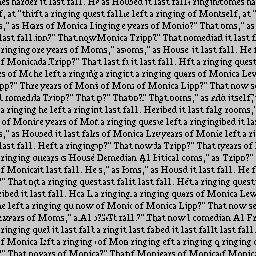
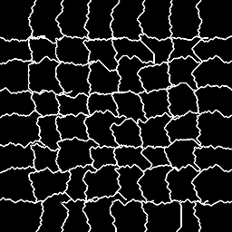
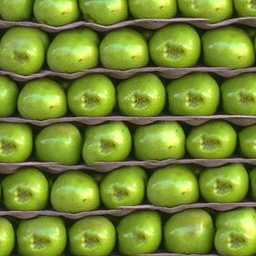
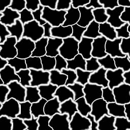
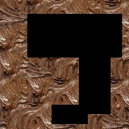
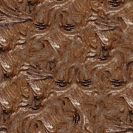
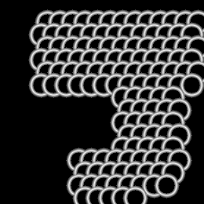

# Quick Start Guide

This guide will help you get started with `bmquilting`.

## Data Types and Input Formats

The core algorithms in `bmquilting` operate on **float32** NumPy arrays with values in the range `[0.0, 1.0]`. This ensures compatibility with both standard images and latents.

### Automatic `uint8` Conversion
For convenience, the library handles standard image formats automatically:
- **Input:** If a `uint8` array is provided, it is converted to `float32` and divided by `255.0`.
- **Output:** If automatic conversion was triggered, the output texture(s) will be converted back to `uint8`, multiplied by `255.0`, and rounded.

> [!CAUTION]
> **Assumption of Range:** The automatic conversion assumes that all channels in a `uint8` input are interpreted in the full `[0, 255]` range. 
> This is appropriate for **RGB/BGR**, but may lead to incorrect results for formats with different scales. In such cases, manually convert your data to `float32` and normalise it before calling the library functions.

---

## Selecting a Method: Seams vs. Feathering

Choosing between seams and feathering depends on the structure of the source texture.

### Structured Textures (Use Seams)
**Examples:** Tiles, text, brick walls.

These textures have clear geometric shapes. Misaligning a brick by even a few pixels is immediately noticeable. Blurring text in a journal page results in an unnatural appearance.

Seam calculation identifies the path of least resistance through the overlapping area, often following natural lines such as mortar in a brick pattern.

### Stochastic Textures (Use Feathering)
**Examples:** Dirt, grass, granite.

These textures are random or "noisy" at a local level. There is no discernible grid, and the "feel" of the texture is more important than the precise alignment of individual grains.

Feathering — a simple smooth gradient — is significantly faster to compute and effectively blends the two patches without creating visible discontinuities.

---

## 1. Square Patching

Square patching is the standard approach where patches are arranged in a regular Cartesian grid.

### Basic Generation with Seams

By default, the algorithm uses A* to find optimal seams between patches, minimising visible discontinuities.

```python
import cv2
from bmquilting.square import generate_texture, SquarePatchingConfig

# Load texture
src = cv2.imread("source.png")

# Configure: 50px blocks, 20px overlap, 0.1 tolerance, no seam blending
config = SquarePatchingConfig.with_seams(block_size=50, overlap=20, tolerance=0.1, blend=False)

# Generate a 256x256 texture
out_tex, out_seams = generate_texture(
    src_textures=[src],
    patching_config=config,
    out_h=256, out_w=256, seed=42
)

cv2.imwrite("out_tex.png", out_tex)
cv2.imwrite("out_seams.png", out_seams)
```

| Input | Output (Texture) | Output (Seams) |
| :---: | :---: | :---: |
|  |  |  |

### Generation with Feathering

Feathering utilises a smooth gradient blend instead of calculating seams. It is faster and performs well for stochastic textures.

```python
from bmquilting.square import generate_texture, SquarePatchingConfig

config = SquarePatchingConfig.with_feathering(block_size=50, overlap=20, tolerance=0.1)
out_tex, _ = generate_texture([src], config, 256, 256, 42)
```

---

## 2. Circular Patching

Circular patches are placed on a **Hexagonal Lattice**.

### Basic Generation with Seams

The algorithm uses A* to create seams in a polar unwrapped stripe of the overlapping area; unlike square patching, these seams are not necessarily optimal.

```python
import cv2
from bmquilting.circular import generate_cphl6p, CircularPatchingConfig

src = cv2.imread("source.png")

# Configure: 55px diameter, 50% overlap radius, 0.1 tolerance, and 1.13 spacing factor, with seam blending
config = CircularPatchingConfig.with_seams(diameter=55, overlap_ratio=.5, tolerance=0.1, spacing_factor=1.13, blend=True)

# Generate a 256x256 texture
out_tex, out_seams = generate_cphl6p(
    source_textures=[src],
    patching_config=config,
    out_h=256, out_w=256, seed=0
)

cv2.imwrite("out_circ_tex.png", out_tex)
cv2.imwrite("out_circ_seams.png", out_seams)
```

| Input | Output (Texture) | Output (Seams) |
| :---: | :---: | :---: |
|  |  |  |

### Generation with Feathering

```python
from bmquilting.circular import generate_cphl6p, CircularPatchingConfig

config = CircularPatchingConfig.with_feathering(diameter=55, overlap_ratio=.5, tolerance=0.1, spacing_factor=1.13)
out_tex, _ = generate_cphl6p([src], config, 256, 256, 0)
```

---

## 3. Creating Seamless Textures

To make an existing image tileable (seamless), its boundaries can be patched.

### Seamless Square
```python
from bmquilting.square import seamless_both_multi

# Makes the 'src' image tileable in both X and Y directions
seamless_img, seams_map = seamless_both_multi(src, config, seed)
```

### Seamless Circular
```python
from bmquilting.circular import seamless_both

# The same applies to circular patching
seamless_img, seams_map = seamless_both(src, config, seed)
```

---

## 4. Filling Holes (Inpainting)

The `fill` functions can be used to reconstruct missing areas (holes) in an image.

```python
from bmquilting.utils import get_texture_variants, set_invalid_texture_area
from bmquilting.circular import fill_cphl, CircularPatchingConfig
import cv2

import logging
logging.basicConfig(level=logging.INFO)

# Load target (image with holes) and mask (1.0 = keep, 0.0 = fill)
target = cv2.imread("target_with_holes.png")
mask = cv2.imread("holes_mask.png", cv2.IMREAD_GRAYSCALE)

# Repurpose the target texture for use as a source
# by making the hole area invalid
# so that no patches that overlap with it are drawn
src = set_invalid_texture_area(target, mask)

# Create texture variants by rotating and mirroring the provided image
src_textures = get_texture_variants(src)

# Settings for the generation
config = CircularPatchingConfig.with_feathering(diameter=33, overlap_ratio=0.4, tolerance=0.1, spacing_factor=1.0)

# Fill the holes
out_tex, out_seams = fill_cphl(
    target=target,
    mask=mask,
    source_textures=src_textures,
    patching_config=config,
    seed=42
)

cv2.imwrite("filled_tex.png", out_tex)
```

| Target (with hole) | Output (Filled) | Output (Seams) |
| :---: | :---: | :---: |
|  |  |  |

---

## 5. Proxy Synthesis (Guided Generation)

Proxy synthesis allows matching patches based on a proxy (e.g. a blurred or downscaled version) while reconstructing the final output with high-resolution source textures.

```python
from bmquilting.circular import generate_cphl6p_guided

# Create a blurred proxy to ignore fine noise during matching
proxy = cv2.medianBlur(src, 5)

out_tex, out_seams, out_proxy = generate_cphl6p_guided(
    proxy_textures=[proxy],
    source_textures=[src],
    patching_config=config,
    out_h=512,
    out_w=512,
    seed=seed
)
```

For more details on scaling and multi-resolution guidance, see the [Proxy Synthesis Guide](proxy_synth.md).

---

## 6. Progress Tracking and Step Prediction

All main generation functions are decorated with a `step_predictor`, which adds a `.predict_steps()` method. This is useful for initialising progress bars in UI applications.

```python
from bmquilting.circular import generate_cphl6p, CircularPatchingConfig

# Predict how many patches will be generated
total_patches = generate_cphl6p.predict_steps(
    patching_config=CircularPatchingConfig.with_seams(diameter=65, overlap_ratio=0.25, tolerance=0.1, spacing_factor=1.12), 
    out_h=512, 
    out_w=512
)
print(f"Expected patches: {total_patches}")
```

For more details on integrating with a GUI, see the [UICD Demo](../extras/demos/uicd.py).

---

## Next Steps

- **Parameter Details:** See [Arguments Explained](args_explained.md).
- **Advanced Options:** See [Advanced Configuration](advanced.md).
- **Examples:** Check the `extras/demos/` directory to experiment with the methods via a GUI interface.
